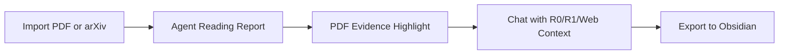

<div align="center">


# Paperflow

**Evidence-first agentic paper workspace.**

Read papers, verify claims, ask an Agent with context, and save durable research knowledge.
Paperflow is not a generic PDF reader: every generated claim is labeled **R0 / R1 / R2** and traced back to PDF evidence whenever possible.

[English](./README.md) · [Chinese](./README.zh-CN.md) · [Landing Page](./index.html)

[](./LICENSE)
[](./LICENSE)
[](https://www.python.org/)
[](https://fastapi.tiangolo.com/)
[](https://react.dev/)
[](https://vitejs.dev/)
[](https://obsidian.md/)

</div>

---

## Core Workflow



Paperflow turns a paper into a reliability-labeled workspace: structured report first, evidence-backed claims second, paper-aware chat third, durable notes last.

---

## Product Demo Strip

<table>
  <tr>
    <td width="20%"></td>
    <td width="20%"></td>
    <td width="20%"></td>
    <td width="20%"></td>
    <td width="20%"></td>
  </tr>
  <tr>
    <td><strong>Import to Report</strong></td>
    <td><strong>Claim to Evidence</strong></td>
    <td><strong>Ask with Evidence</strong></td>
    <td><strong>R0/R1/R2</strong></td>
    <td><strong>Obsidian Export</strong></td>
  </tr>
</table>


---

## Quick Demo

Use one paper to see the full loop:

1. Import a local PDF or paste an arXiv URL.
2. Let the Agent generate a structured Reading Report.
3. Click a reliability-labeled claim.
4. Jump to the supporting PDF page and highlight the evidence.
5. Ask the Agent: "What evidence supports this limitation?"
6. Save or update the Obsidian note.

---

## Why Paperflow Is Different

- **R0/R1/R2 reliability model**: separates paper-grounded facts, external context, and higher-level inference.
- **PDF evidence grounding**: claims can jump back to the PDF page and highlight supporting text.
- **Agent chat with paper + web/model context**: chat is grounded in the report, selected evidence, R1 cache, and optional web/model knowledge.
- **Local-first research memory**: PDFs, report JSON, SQLite metadata, and Obsidian notes stay under local project data.
- **Obsidian export**: reading outputs become durable knowledge, not disposable chat history.

The product stance is simple: **report first, chat second, evidence always**.

---

## News

- **2026-05-13 — v0.1 released.** Paperflow now presents a public-facing evidence-first agentic paper workspace: PDF evidence highlighting, responsive PDF search, Agent chat grounding, local-first research memory, and Obsidian export. Future small feature releases will use the `v0.1.x` format.

---

## Quickstart

> Requirements: Python 3.9+, Node.js 18+, and a DeepSeek API key for real Agent parsing.
> Windows users additionally need tmux (provided by psmux): `winget install psmux` (registered as the `tmux` command after install).

**All Windows commands are written for CMD (`cmd.exe`).**

**Linux / macOS**

```bash
git clone https://github.com/shiml20/PaperFlow.git
cd PaperFlow

export DEEPSEEK_API_KEY="your-deepseek-api-key"
cd paperflow
./run-dev.sh --install
```

**Windows (CMD)**

```cmd
git clone https://github.com/shiml20/PaperFlow.git
cd PaperFlow

set DEEPSEEK_API_KEY=your-deepseek-api-key
cd paperflow
run-dev.bat --install
```

Then open `http://127.0.0.1:5173`, import a PDF or arXiv URL, and open the Workspace.

If dependencies are already installed:

**Linux / macOS**

```bash
export DEEPSEEK_API_KEY="your-deepseek-api-key"
cd paperflow
./run-dev.sh
```

**Windows (CMD)**

```cmd
set DEEPSEEK_API_KEY=your-deepseek-api-key
cd paperflow
run-dev.bat
```

---

## How To Use

1. Import a local PDF or paste an arXiv URL.
2. Watch the Agent move from PDF parsing to dynamic partial reports.
3. Read the first key findings while the full report continues to fill in.
4. Open the completed Reading Report and inspect R0 / R1 / R2 claims.
5. Click a claim or evidence item to inspect source text and PDF location.
6. Ask the Agent a focused question grounded in the current paper.
7. Save or update the Obsidian note.

---

## DeepSeek Setup

Paperflow currently supports DeepSeek as the Agent API provider.
The fastest setup is `DEEPSEEK_API_KEY`.

| Variable | Required | Default | Purpose |
| --- | --- | --- | --- |
| `DEEPSEEK_API_KEY` | Yes | none | DeepSeek API key used by the backend PaperAgent. |
| `DEEPSEEK_BASE_URL` | No | `https://api.deepseek.com/beta` | DeepSeek-compatible chat completions endpoint root. |
| `DEEPSEEK_MODEL` | No | `deepseek-v4-flash` | Model used for Reading Report generation. |
| `DEEPSEEK_REPORT_READ_TIMEOUT` | No | `180` | Read timeout in seconds for report generation. |
| `DEEPSEEK_CONFIG_PATH` | No | `~/.deepseek/config.toml` | Alternate config file path. |

Example config file:

```toml
api_key = "your-deepseek-api-key"
base_url = "https://api.deepseek.com/beta"
model = "deepseek-v4-flash"
```

`default_text_model` from older DeepSeek-TUI config files is ignored for Paperflow's report model. This keeps the Paperflow default on `deepseek-v4-flash` unless `DEEPSEEK_MODEL` or `model` is set explicitly.

Without a DeepSeek key, the backend reports `Agent not configured` and cannot produce a real R0/R1 Reading Report.

---

## Manual Run

### Backend

**Linux / macOS**

```bash
cd paperflow/backend
python3 -m venv .venv
. .venv/bin/activate
pip install -e '.[dev]'

export DEEPSEEK_API_KEY="your-key"
export DEEPSEEK_MODEL="deepseek-v4-flash"
export DEEPSEEK_REPORT_READ_TIMEOUT="180"

uvicorn app.main:app --reload
```

**Windows (CMD)**

```cmd
cd paperflow\backend
python -m venv .venv
.venv\Scripts\activate.bat
pip install -e .[dev]

set DEEPSEEK_API_KEY=your-key
set DEEPSEEK_MODEL=deepseek-v4-flash
set DEEPSEEK_REPORT_READ_TIMEOUT=180

uvicorn app.main:app --reload
```

### Web Frontend

**Linux / macOS**

```bash
cd paperflow/frontend
npm install
npm run dev
```

**Windows (CMD)**

```cmd
cd paperflow\frontend
npm install
npm run dev
```

Open `http://localhost:5173`.

### TUI

Paperflow also ships a Textual-based terminal UI that talks to the same backend.

**Linux / macOS**

```bash
cd paperflow/backend && . .venv/bin/activate
pip install -e ../tui

paperflow-tui
# or
PAPERFLOW_BASE_URL=http://127.0.0.1:8000 paperflow-tui
# or
python -m paperflow_tui
```

**Windows (CMD)**

```cmd
cd paperflow\backend
.venv\Scripts\activate.bat
pip install -e ..\tui

paperflow-tui
rem or
set PAPERFLOW_BASE_URL=http://127.0.0.1:8000
paperflow-tui
rem or
python -m paperflow_tui
```

Useful bindings:

| Where | Key | Action |
| --- | --- | --- |
| Library | `i` | Import a local PDF |
| Library | `a` | Import an arXiv URL / ID |
| Library | `o` / `Enter` | Open the selected paper's Workspace |
| Library | `r` | Re-run the PaperAgent |
| Library | `R` | Refresh library + agent status |
| Workspace | `j` / `k` / arrows | Navigate claims |
| Workspace | `Enter` | Inspect evidence |
| Workspace | `a` | Ask a focused R0 / R1 / R2 question |
| Workspace | `1` | Run R1 related-work search |
| Workspace | `2` | Open Field Map |
| Workspace | `s` | Save / update Obsidian note |
| Workspace | `b` / `Esc` | Back to Library |

---

## Core Features

### Dynamic Reading Reports

- **Chunked full-paper reading**: long PDFs are split into bounded chunks instead of being summarized from only the first text window.
- **Dynamic partial reports**: the first completed chunk is saved immediately, so readers can see key findings before the whole paper finishes.
- **Coverage-aware generation**: the UI shows progress such as `full-paper coverage 50%`, then `full-paper coverage 100% · 8 chunks` when all chunks are covered.
- **Live parsing metrics**: elapsed time keeps ticking while generation is running; tokens, coverage, and chunk count update as new partial reports arrive.
- **Transparent process output**: the Workspace shows PDF text extraction, DeepSeek request preparation, model wait, chunk coverage, report persistence, and failure states.

### Evidence-First Workspace

- R0 / R1 / R2 reliability badges in the UI and data model.
- Evidence quote, page, section, bbox, and `location_status` for claims when available.
- PDF.js reader with page jump, bbox highlight, and select-to-ask.
- Right-side evidence detail panel for selected claims.
- Obsidian-native Markdown export with frontmatter, wikilinks, callouts, and reliability tags.

### Agent Conversation

- A formal right-rail Agent panel with transcript, process cards, status, and composer.
- Chat transcripts are persisted in SQLite and restored when the Workspace opens.
- `/chat` is backed by a DeepSeek chat agent over report + selected evidence + R1 cache, with a report-grounded fallback.
- `/chat/stream` provides SSE step/final events for the frontend.
- Runtime Agent configuration in the web UI: update local DeepSeek API key, switch model, and change report timeout.

### Literature Context And Field Maps

- Metadata import via arXiv, CrossRef, Semantic Scholar, OpenReview, and Zotero.
- Content-hash + DOI + arXiv-ID deduplication.
- Six-lane R1 search: seed, backward, forward, benchmark, survey, and recent.
- Field Map generation: milestones, timeline, task taxonomy, datasets, benchmarks, method families, open problems, trends, and R2 opportunities.
- Agent-enriched Field Map / lineage graph edges with source type, rationale, confidence, and UI labels.
- Multi-paper comparison and R2 research insights with Obsidian export.

---

## Reliability Model

| Level | Meaning | Examples |
| --- | --- | --- |
| **R0** | Strictly grounded in the current paper. Numbers must not be inferred or compared across settings. | "The model is trained on 8xA100 for 72 hours." |
| **R1** | Grounded in another paper / source fetched through external search. Source paper, venue, year, and URL should be recorded. | "This benchmark was introduced in paper X." |
| **R2** | Inference, trend judgement, or research opinion. Always shown with an R2 badge. | "This direction is likely to converge with diffusion priors." |

Reliability is rendered as a UI badge, persisted in JSON, embedded as `#R0` / `#R1` / `#R2` tags in Obsidian notes, and enforced inside the PaperAgent prompt contract.

---

## Architecture

Paperflow ships two front-ends sharing the same backend agent harness:

```text
┌──────────────────────────────┐                ┌──────────────────────────────────┐
│  Web Frontend (React + Vite) │                │  Backend (FastAPI)               │
│  - Library-first home        │ ─── REST ───► │  - PaperStorage (SQLite + files) │
│  - Report-first Workspace    │                │  - PDF parser (PyMuPDF)          │
│  - Agent rail + evidence     │                │  - ReportService                 │
│  - PDF viewer                │                │  - PaperAgent (DeepSeek client)  │
└──────────────────────────────┘                └──────────────┬───────────────────┘
                                                               │
┌──────────────────────────────┐                               │
│  TUI (Textual + httpx)       │ ─── REST ────────────────────►│
│  - Same Library + Workspace  │                               │
│  - R0/R1/R2 badges           │                               │
│  - Keyboard-driven           │                               │
└──────────────────────────────┘                               ▼
                                                 ┌──────────────────────────┐
                                                 │  Local Data              │
                                                 │  - PDFs                  │
                                                 │  - report JSON           │
                                                 │  - Obsidian vault notes  │
                                                 │  - SQLite metadata       │
                                                 └──────────────────────────┘
```

The agent harness lives only in the backend. Both the web frontend and the TUI are thin HTTP clients.

**Tech stack:** Python 3.9+ · FastAPI · Pydantic · PyMuPDF · httpx · pytest · React · TypeScript · Vite · Vitest · Textual · Rich · SQLite · DeepSeek API.

---

## Data And Schema

User data is stored under the project-level `data/` directory and is git-ignored by default.
This single location is used no matter whether the backend is started from the repository root,
`paperflow/`, or `paperflow/backend/`. Set `PAPERFLOW_DATA_DIR` only if you intentionally want
to override the local data root.

Every R0 claim follows this shape:

```json
{
  "id": "claim-id",
  "text": "English explanation",
  "reliability": "R0",
  "evidence": [
    {
      "source": "paper.pdf",
      "quote": "verbatim quote from the PDF",
      "page": 3,
      "section": "Method",
      "bbox": null,
      "location_status": "page_and_quote"
    }
  ],
  "uncertainty": null
}
```

A full Reading Report covers paper metadata, executive summary, task, dataset, benchmark/metric, method, model scale, input/output, compute/training, key results, strengths, limitations, related-work claims, and an evidence index.

---

## Repository Layout

```text
PaperFlow/
├── README.md
├── README.zh-CN.md
├── index.html
├── LICENSE
├── assets/
│   ├── README.html                       ← GitHub Pages-friendly README
│   ├── favicon.svg
│   └── paperflow_banner.png
├── data/                                 ← local user data, git-ignored
├── design_docs/                         ← local design / PRD notes
└── paperflow/
    ├── run-dev.sh                       ← starts backend + frontend (Linux / macOS)
    ├── run-dev.bat                      ← starts backend + frontend (Windows CMD + tmux)
    ├── backend/                         ← FastAPI + PaperAgent harness
    ├── frontend/                        ← React + Vite + TypeScript web client
    └── tui/                             ← Textual terminal client
```

---

## Testing

**Linux / macOS**

```bash
# Backend
cd paperflow/backend
. .venv/bin/activate
pytest -q

# Frontend
cd ../frontend
npm test
npm run build

# TUI
cd ../tui
pytest -q
```

**Windows (CMD)**

```cmd
rem Backend
cd paperflow\backend
.venv\Scripts\activate.bat
pytest -q

rem Frontend
cd ..\frontend
npm test
npm run build

rem TUI
cd ..\tui
pytest -q
```

---

## Contributing

Paperflow is early, but the reliability contract is stable. Good first contributions:

- **Field timelines and domain maps**: curate timelines, milestones, method families, datasets, benchmarks, and open problems for specific research areas.
- **Friendlier interaction design**: improve the reading flow, evidence navigation, PDF highlight experience, Agent chat UX, keyboard shortcuts, and onboarding.
- **Other improvements**: parsing fidelity, evidence-location checks, Obsidian rendering, tests, docs, localization, and small reliability-focused fixes.

Please keep PRs aligned with the reliability contract: every UI surface that produces a fact should be expressible as R0 / R1 / R2 with evidence.

---

## License

Paperflow is released under the [**PolyForm Noncommercial License 1.0.0**](./LICENSE).

- You may freely use, copy, modify, and distribute Paperflow for noncommercial purposes.
- You may not use Paperflow for commercial purposes without a separate commercial license.
- Forks and derivative works must keep this license and the `Required Notice` line in [`LICENSE`](./LICENSE).
- The software is provided as is, without warranty of any kind.

For commercial use, please open an issue on the [GitHub repository](https://github.com/shiml20/PaperFlow) to discuss a commercial license.

Copyright © 2026 shiml20 and Paperflow contributors.

---

## Acknowledgements

- Agent integration is built against the DeepSeek API and reuses configuration written by the DeepSeek-TUI CLI when present.
- PDF parsing is powered by [PyMuPDF](https://github.com/pymupdf/PyMuPDF).
- The frontend is built with [Vite](https://vitejs.dev/) and [React](https://react.dev/).
- The prompt design was inspired by Peng Sida's open research-learning notes, [pengsida/learning_research](https://github.com/pengsida/learning_research).

If Paperflow is useful to your research workflow, a star is the kindest signal.

---

## Status

For release history and milestone details, see [`STATUS.md`](./STATUS.md).
