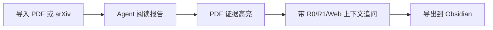

<div align="center">


# Paperflow

**证据优先的 agentic paper 阅读工作台。**

用于阅读论文、核验证据、追问 Agent、沉淀知识。Paperflow 不是普通 PDF 阅读器：每个生成结论都带 **R0 / R1 / R2** 可靠性标记，并尽可能回到 PDF 原文证据。

[英文版](./README.md) · [中文版](./README.zh-CN.md) · [项目首页](./index.html)

[](./LICENSE)
[](./LICENSE)
[](https://www.python.org/)
[](https://fastapi.tiangolo.com/)
[](https://react.dev/)
[](https://vitejs.dev/)
[](https://obsidian.md/)

</div>

---

## 核心工作流



Paperflow 把一篇论文变成可追溯的研究工作台：先生成结构化报告，再核验 PDF 证据，然后带着证据追问 Agent，最后沉淀到 Obsidian。

---

## 产品演示图

<table>
  <tr>
    <td width="20%"></td>
    <td width="20%"></td>
    <td width="20%"></td>
    <td width="20%"></td>
    <td width="20%"></td>
  </tr>
  <tr>
    <td><strong>导入到阅读报告</strong></td>
    <td><strong>结论跳转证据</strong></td>
    <td><strong>带证据追问</strong></td>
    <td><strong>可靠性分级</strong></td>
    <td><strong>沉淀到知识库</strong></td>
  </tr>
</table>


---

## 快速演示

用一篇论文跑完整流程：

1. 导入本地 PDF，或粘贴 arXiv URL。
2. 等待 Agent 生成结构化阅读报告。
3. 点击带可靠性标记的结论。
4. 跳转到 PDF 原文页并高亮支持证据。
5. 追问 Agent："这条 limitation 的证据是什么？"
6. 保存或更新 Obsidian 笔记。

---

## Paperflow 有什么不同

- **R0/R1/R2 可靠性分级**：区分当前论文事实、外部上下文和高层推断。
- **PDF 证据定位**：结论可以跳回 PDF 页面并高亮支持文本。
- **带上下文的 Agent 对话**：对话基于阅读报告、选中证据、R1 缓存，以及可选的 Web/模型知识。
- **本地优先研究记忆**：PDF、报告 JSON、SQLite 元数据、Obsidian 笔记保存在本地。
- **知识库沉淀**：阅读结果变成长期知识，而不是一次性聊天记录。

产品原则很简单：**先报告，后聊天；始终回到证据。**

---

## 最新动态

- **2026-05-13 — v0.1 发布。** Paperflow 现在以证据优先的 agentic paper 阅读工作台对外呈现：PDF 原文证据高亮、响应式 PDF 搜索、Agent 对话 grounding、本地优先研究记忆，以及 Obsidian 导出。以后小功能发版使用 `v0.1.x` 格式。

---

## 快速开始

> 需要 Python 3.9+、Node.js 18+，以及用于真实 Agent 解析的 DeepSeek API Key。
> Windows 用户额外需要 tmux（由 psmux 提供）：`winget install psmux`（安装后默认注册为 `tmux` 命令）。

**Windows 命令均以 CMD（`cmd.exe`）为工作环境。**

**Linux / macOS**

```bash
git clone https://github.com/shiml20/PaperFlow.git
cd PaperFlow

export DEEPSEEK_API_KEY="your-deepseek-api-key"
cd paperflow
./run-dev.sh --install
```

**Windows (CMD)**

```cmd
git clone https://github.com/shiml20/PaperFlow.git
cd PaperFlow

set DEEPSEEK_API_KEY=your-deepseek-api-key
cd paperflow
run-dev.bat --install
```

然后打开 `http://127.0.0.1:5173`，导入 PDF 或 arXiv URL，进入 Workspace。

如果依赖已经安装过：

**Linux / macOS**

```bash
export DEEPSEEK_API_KEY="your-deepseek-api-key"
cd paperflow
./run-dev.sh
```

**Windows (CMD)**

```cmd
set DEEPSEEK_API_KEY=your-deepseek-api-key
cd paperflow
run-dev.bat
```

---

## 如何使用

1. 导入本地 PDF，或粘贴 arXiv URL。
2. 等待 Agent 从 PDF 解析进入动态部分报告。
3. 首个 chunk 完成后先看关键发现，完整报告会继续补全。
4. 打开阅读报告，检查 R0 / R1 / R2 结论。
5. 点击 claim 或 evidence，查看原文证据和 PDF 位置。
6. 在右侧 Agent 对话区基于当前论文继续追问。
7. 保存或更新 Obsidian 笔记。

---

## DeepSeek 配置

Paperflow 当前只支持 DeepSeek 作为 Agent API provider。
最快方式是设置 `DEEPSEEK_API_KEY`。

| 变量 | 必需 | 默认值 | 作用 |
| --- | --- | --- | --- |
| `DEEPSEEK_API_KEY` | 是 | 无 | 后端 PaperAgent 使用的 DeepSeek API Key。 |
| `DEEPSEEK_BASE_URL` | 否 | `https://api.deepseek.com/beta` | DeepSeek-compatible chat completions endpoint root。 |
| `DEEPSEEK_MODEL` | 否 | `deepseek-v4-flash` | 阅读报告默认模型。 |
| `DEEPSEEK_REPORT_READ_TIMEOUT` | 否 | `180` | 报告生成 read timeout，单位秒。 |
| `DEEPSEEK_CONFIG_PATH` | 否 | `~/.deepseek/config.toml` | 自定义配置文件路径。 |

配置文件示例：

```toml
api_key = "your-deepseek-api-key"
base_url = "https://api.deepseek.com/beta"
model = "deepseek-v4-flash"
```

旧 DeepSeek-TUI 配置里的 `default_text_model` 不会覆盖 Paperflow 的默认报告模型。除非显式设置 `DEEPSEEK_MODEL` 或 `model`，否则默认使用 `deepseek-v4-flash`。

没有 DeepSeek Key 时，后端会报告 `Agent not configured`，无法生成真实 R0/R1 阅读报告。

---

## 手动运行

### 后端

**Linux / macOS**

```bash
cd paperflow/backend
python3 -m venv .venv
. .venv/bin/activate
pip install -e '.[dev]'

export DEEPSEEK_API_KEY="your-key"
export DEEPSEEK_MODEL="deepseek-v4-flash"
export DEEPSEEK_REPORT_READ_TIMEOUT="180"

uvicorn app.main:app --reload
```

**Windows (CMD)**

```cmd
cd paperflow\backend
python -m venv .venv
.venv\Scripts\activate.bat
pip install -e .[dev]

set DEEPSEEK_API_KEY=your-key
set DEEPSEEK_MODEL=deepseek-v4-flash
set DEEPSEEK_REPORT_READ_TIMEOUT=180

uvicorn app.main:app --reload
```

### Web 前端

**Linux / macOS**

```bash
cd paperflow/frontend
npm install
npm run dev
```

**Windows (CMD)**

```cmd
cd paperflow\frontend
npm install
npm run dev
```

打开 `http://localhost:5173`。

### TUI

Paperflow 也提供 Textual 终端 UI，连接同一个后端。

**Linux / macOS**

```bash
cd paperflow/backend && . .venv/bin/activate
pip install -e ../tui

paperflow-tui
# 或
PAPERFLOW_BASE_URL=http://127.0.0.1:8000 paperflow-tui
# 或
python -m paperflow_tui
```

**Windows (CMD)**

```cmd
cd paperflow\backend
.venv\Scripts\activate.bat
pip install -e ..\tui

paperflow-tui
rem 或
set PAPERFLOW_BASE_URL=http://127.0.0.1:8000
paperflow-tui
rem 或
python -m paperflow_tui
```

常用快捷键：

| 位置 | 按键 | 动作 |
| --- | --- | --- |
| Library | `i` | 导入本地 PDF |
| Library | `a` | 导入 arXiv URL / ID |
| Library | `o` / `Enter` | 打开选中论文 Workspace |
| Library | `r` | 重新运行 PaperAgent |
| Library | `R` | 刷新 library 和 agent status |
| Workspace | `j` / `k` / arrows | 导航 claims |
| Workspace | `Enter` | 查看 evidence |
| Workspace | `a` | 提出 R0 / R1 / R2 聚焦问题 |
| Workspace | `1` | 运行 R1 related-work search |
| Workspace | `2` | 打开 Field Map |
| Workspace | `s` | 保存 / 更新 Obsidian 笔记 |
| Workspace | `b` / `Esc` | 返回 Library |

---

## 核心功能

### 动态阅读报告

- **长论文分 chunk 读取**：不再只截取 PDF 前面一段。
- **动态部分报告**：首个 chunk 完成后立即保存，读者可以先看关键发现。
- **覆盖率感知 UI**：显示 `覆盖全文 50%`、`覆盖全文 100% · 8 chunks` 等状态。
- **实时解析指标**：生成中 elapsed time 会动态更新，tokens、coverage、chunk count 会随部分报告刷新。
- **透明过程输出**：展示 PDF 文本抽取、DeepSeek 请求准备、模型等待、chunk 覆盖、报告落盘、失败状态。

### 证据优先 Workspace

- R0 / R1 / R2 可靠性标签进入 UI 和数据模型。
- claim 尽量携带 evidence quote、page、section、bbox 和 `location_status`。
- PDF.js 阅读器支持跳页、bbox highlight、选区追问。
- 右侧 evidence detail 面板展示当前 claim 的证据。
- Obsidian-native Markdown 导出支持 frontmatter、wikilinks、callouts、reliability tags。

### Agent 对话区

- 右侧正式 Agent panel：transcript、process cards、status、composer。
- Chat transcript 持久化到 SQLite，Workspace 打开时自动恢复。
- `/chat` 使用 DeepSeek chat agent，读取 report + selected evidence + R1 cache，并保留 report-grounded fallback。
- `/chat/stream` 提供 SSE step/final events。
- Web UI 可运行时更新本地 DeepSeek API Key、切换模型、调整报告 timeout。

### 文献脉络与 Field Map

- 支持 arXiv、CrossRef、Semantic Scholar、OpenReview、Zotero metadata import。
- 基于 content hash + DOI + arXiv ID 去重。
- 六路 R1 search：seed、backward、forward、benchmark、survey、recent。
- Field Map 包含 milestones、timeline、task taxonomy、datasets、benchmarks、method families、open problems、trends、R2 opportunities。
- Field Map / lineage graph edge 带 Agent enrichment：source type、rationale、confidence、UI label。
- 支持多论文 compare、R2 research insights 和 Obsidian export。

---

## 可靠性模型

| 等级 | 含义 | 示例 |
| --- | --- | --- |
| **R0** | 严格来自当前论文。数字不能跨设置推断或比较。 | "The model is trained on 8xA100 for 72 hours." |
| **R1** | 来自其他论文 / 外部来源，需要记录来源论文、venue、year、URL。 | "This benchmark was introduced in paper X." |
| **R2** | 推断、趋势判断、研究观点，必须带 R2 标签。 | "This direction is likely to converge with diffusion priors." |

可靠性不是附加 metadata，而是 UI badge、JSON 持久化、Obsidian `#R0` / `#R1` / `#R2` 标签和 Agent prompt contract 的核心。

---

## 架构

Paperflow 有两个前端，共用同一个后端 Agent harness：

```text
┌──────────────────────────────┐                ┌──────────────────────────────────┐
│  Web Frontend (React + Vite) │                │  Backend (FastAPI)               │
│  - Library-first home        │ ─── REST ───► │  - PaperStorage (SQLite + files) │
│  - Report-first Workspace    │                │  - PDF parser (PyMuPDF)          │
│  - Agent rail + evidence     │                │  - ReportService                 │
│  - PDF viewer                │                │  - PaperAgent (DeepSeek client)  │
└──────────────────────────────┘                └──────────────┬───────────────────┘
                                                               │
┌──────────────────────────────┐                               │
│  TUI (Textual + httpx)       │ ─── REST ────────────────────►│
│  - Same Library + Workspace  │                               │
│  - R0/R1/R2 badges           │                               │
│  - Keyboard-driven           │                               │
└──────────────────────────────┘                               ▼
                                                 ┌──────────────────────────┐
                                                 │  Local Data              │
                                                 │  - PDFs                  │
                                                 │  - report JSON           │
                                                 │  - Obsidian vault notes  │
                                                 │  - SQLite metadata       │
                                                 └──────────────────────────┘
```

Agent harness 只在后端。Web 前端和 TUI 都是薄 HTTP client。

**技术栈：** Python 3.9+ · FastAPI · Pydantic · PyMuPDF · httpx · pytest · React · TypeScript · Vite · Vitest · Textual · Rich · SQLite · DeepSeek API。

---

## 数据与 Schema

用户数据统一存放在项目根目录的 `data/`，默认 git-ignored。
无论 backend 从仓库根目录、`paperflow/` 还是 `paperflow/backend/` 启动，都会使用这一个位置。
只有在你明确想覆盖本地数据目录时，才需要设置 `PAPERFLOW_DATA_DIR`。

每个 R0 claim 的基本结构：

```json
{
  "id": "claim-id",
  "text": "中文解释",
  "reliability": "R0",
  "evidence": [
    {
      "source": "paper.pdf",
      "quote": "PDF 原文引用",
      "page": 3,
      "section": "方法",
      "bbox": null,
      "location_status": "page_and_quote"
    }
  ],
  "uncertainty": null
}
```

完整阅读报告覆盖元数据、执行摘要、任务、数据集、基准与指标、方法、模型规模、输入输出、计算与训练、关键结果、优势、局限、相关工作结论和证据索引。

---

## 仓库结构

```text
PaperFlow/
├── README.md
├── README.zh-CN.md
├── index.html
├── LICENSE
├── assets/
│   ├── README.html                       ← GitHub Pages 友好的 README 页面
│   ├── favicon.svg
│   └── paperflow_banner.png
├── data/                                 ← 本地用户数据，git-ignored
├── design_docs/                         ← 本地设计 / PRD 笔记
└── paperflow/
    ├── run-dev.sh                       ← 启动 backend + frontend（Linux / macOS）
    ├── run-dev.bat                      ← 启动 backend + frontend（Windows CMD + tmux）
    ├── backend/                         ← FastAPI + PaperAgent harness
    ├── frontend/                        ← React + Vite + TypeScript web client
    └── tui/                             ← Textual terminal client
```

---

## 测试

**Linux / macOS**

```bash
# Backend
cd paperflow/backend
. .venv/bin/activate
pytest -q

# Frontend
cd ../frontend
npm test
npm run build

# TUI
cd ../tui
pytest -q
```

**Windows (CMD)**

```cmd
rem Backend
cd paperflow\backend
.venv\Scripts\activate.bat
pytest -q

rem Frontend
cd ..\frontend
npm test
npm run build

rem TUI
cd ..\tui
pytest -q
```

---

## 贡献

Paperflow 还在早期，但 reliability contract 已经稳定。适合优先贡献的方向：

- **领域时间线与领域地图梳理**：补充具体研究方向的 timeline、milestones、method families、datasets、benchmarks 和 open problems。
- **更友好的交互方式**：改进阅读流程、证据导航、PDF 高亮体验、Agent 对话 UX、快捷键、onboarding。
- **其他改进**：PDF 解析质量、evidence 定位检查、Obsidian 渲染、测试、文档、本地化，以及围绕可靠性的细节修复。

请保持 PR 与可靠性契约一致：任何产生事实的 UI 表面，都应该能表示为 R0 / R1 / R2 并带证据。

---

## 授权

Paperflow 使用 [**PolyForm Noncommercial License 1.0.0**](./LICENSE)。

- 可自由用于非商业目的，包括学术研究、教学、个人学习、公益 / 教育 / 政府 / 公共研究组织内部使用。
- 未经单独商业授权，不可用于商业目的，包括付费托管、嵌入商业产品、公司内部生产工具等。
- fork 和衍生作品必须保留该授权和 [`LICENSE`](./LICENSE) 中的必要声明。
- 软件按现状提供，不含任何担保。

商业使用请在 [GitHub 仓库](https://github.com/shiml20/PaperFlow) 开 issue 讨论商业授权。

Copyright © 2026 shiml20 and Paperflow contributors.

---

## 致谢

- Agent 集成基于 DeepSeek API，并可复用 DeepSeek-TUI CLI 写入的配置。
- PDF 解析基于 [PyMuPDF](https://github.com/pymupdf/PyMuPDF)。
- 前端基于 [Vite](https://vitejs.dev/) 和 [React](https://react.dev/)。
- Prompt 设计受到彭思达开源科研经验文档 [pengsida/learning_research](https://github.com/pengsida/learning_research) 的启发。

如果 Paperflow 对你的研究流程有帮助，欢迎 star。

---

## 项目状态

发版历史与里程碑细节见 [`STATUS.zh-CN.md`](./STATUS.zh-CN.md)。
